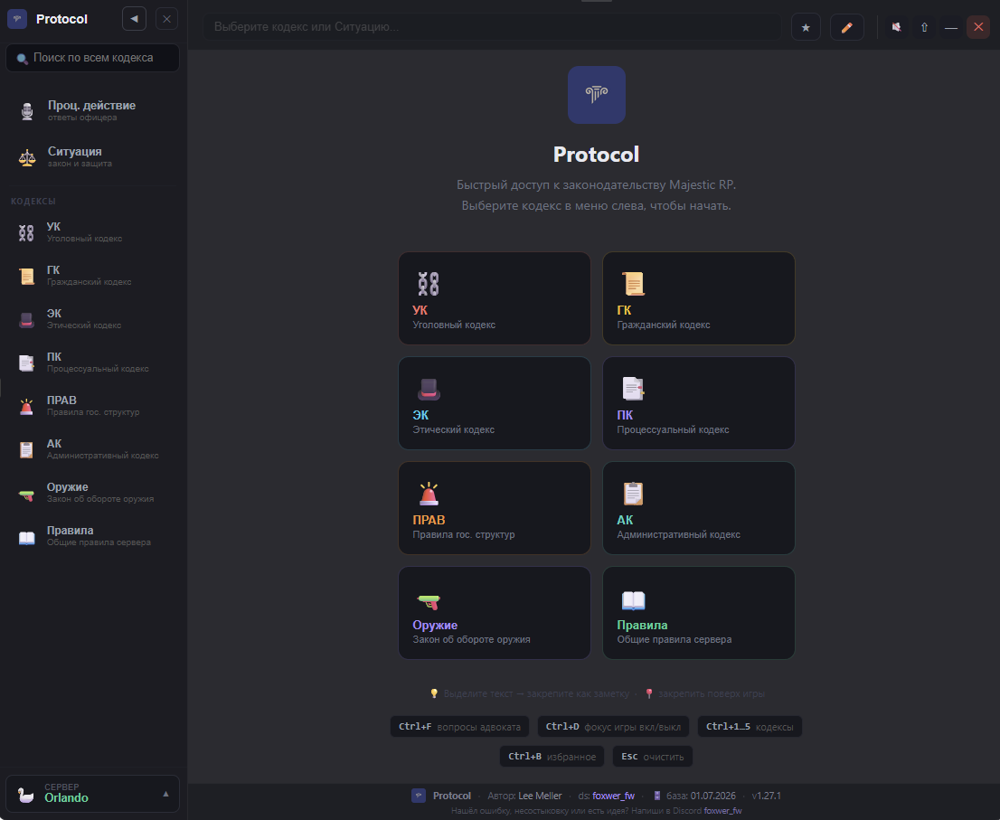
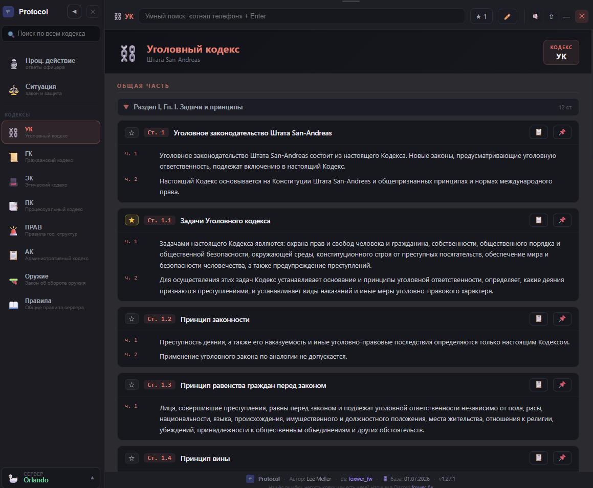
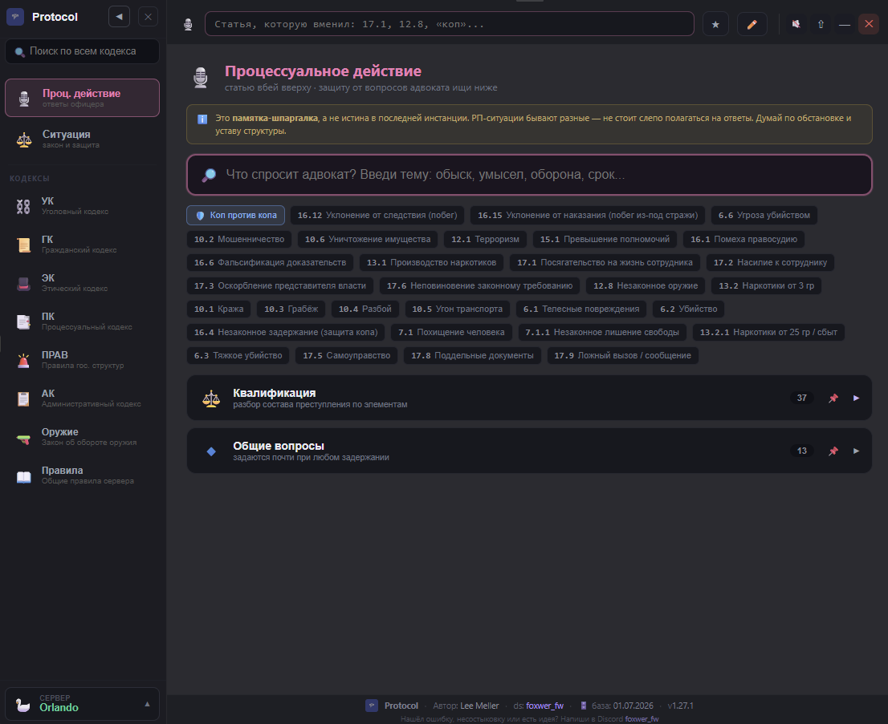
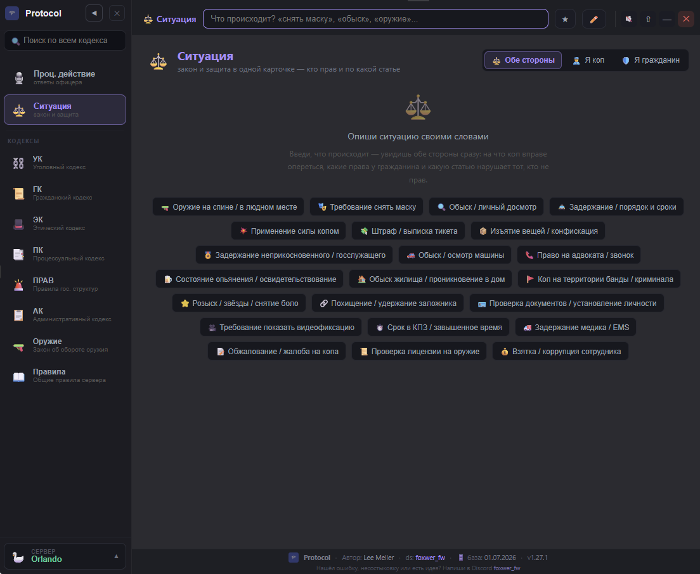
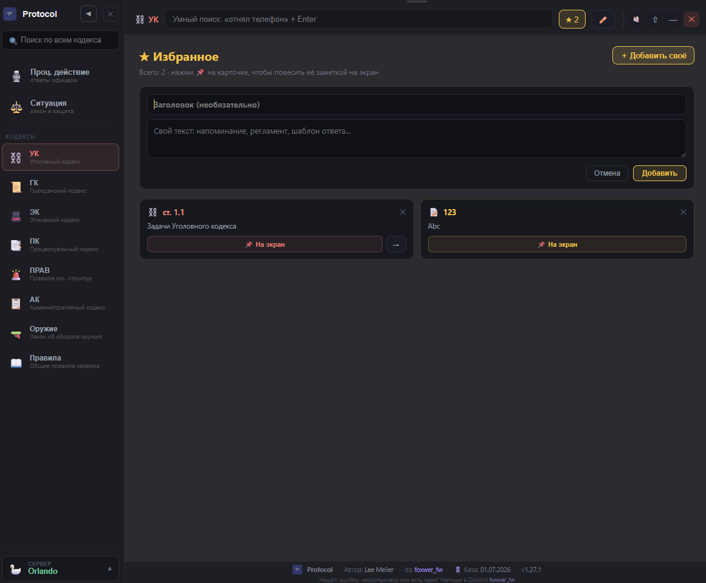
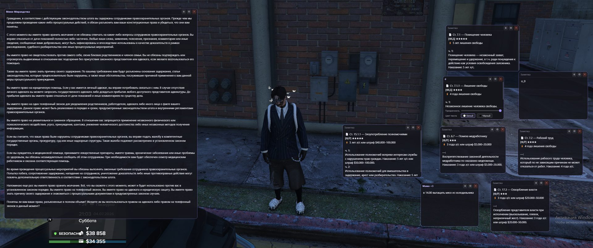
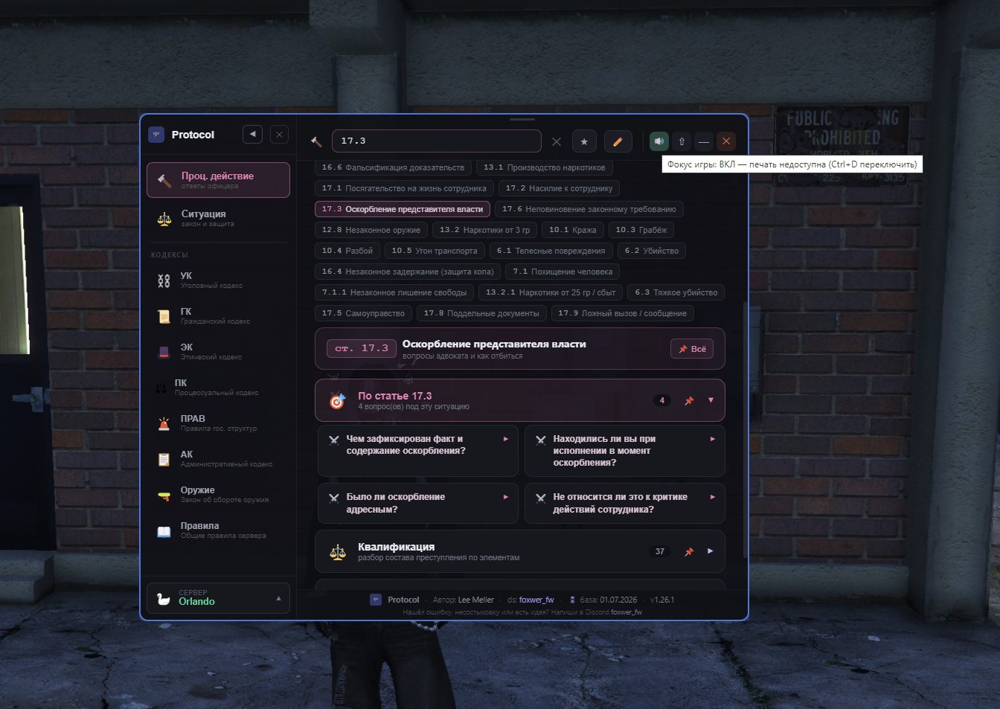

# Protocol

### Быстрый справочник по законам Majestic RP — прямо поверх игры

Все кодексы, разбор ситуаций «кто прав и по какой статье», защита от вопросов адвоката на допросе, заметки-стикеры поверх игры и умный поиск — в одном лёгком приложении для Windows.

 

 

 

> [!IMPORTANT]
> **Это справочник-шпаргалка, а не истина в последней инстанции.** РП-ситуации бывают разные, а официальные правила сервера — единственный первоисточник. Не полагайся слепо на приложение: думай по обстановке и уставу структуры. База актуальна на дату, указанную в футере приложения.

 

## 📖 Содержание

- [Установка](#-установка)
- [Возможности](#-возможности)
- [Горячие клавиши](#-горячие-клавиши)
- [Управление окном](#-управление-окном)
- [О серверах и правилах](#-о-серверах-и-правилах)
- [Частые вопросы](#-частые-вопросы)
- [Обратная связь](#-обратная-связь)

 

## 📊 Что внутри

| 📚 Кодексов | 📄 Статей | ⚖️ Ситуаций | 🎙️ Разборов допроса |
|:-----------:|:---------:|:-----------:|:-------------------:|
| **8** | **446** | **22** | **30** |

 

## 🚀 Установка

Никакой сборки и настройки — просто скачай и запусти.

1. Открой страницу **[Releases](../../releases/latest)**
2. Скачай файл **`Protocol.exe`**
3. Запусти — приложение сразу готово к работе

> **Portable-версия:** не требует установки и не оставляет следов в системе. Просто держи `Protocol.exe` в удобной папке или на рабочем столе.

 

## ✨ Возможности

### 📚 Все кодексы в одном месте

Уголовный (УК), Гражданский (ГК), Этический (ЭК), Процессуальный (ПК), Административный (АК), Правила гос. структур, Закон об оружии и Общие правила сервера — с удобной навигацией по разделам и главам, звёздочками избранного и кнопками «закрепить на экран».

 

### 🎙️ Процессуальное действие — защита на допросе

Вбей статью, которую вменяют, и получи готовые ответы на каверзные вопросы адвоката: **что спросят → что отвечать → где ловушка**. Разбор по составу преступления, общие вопросы к любому задержанию и отдельный блок «коп против копа».

 

### ⚖️ Ситуация — кто прав и по какой статье

Опиши ситуацию своими словами — «сняли маску», «обыск», «оружие» — и умный поиск покажет **обе стороны сразу**: на что вправе опереться коп, какие права у гражданина и какую статью нарушает тот, кто не прав. Поиск понимает живую речь и синонимы.

 

### ⭐ Избранное и свои заметки

Сохраняй нужные статьи в избранное, добавляй собственные заметки с заголовками (шаблоны ответов, напоминания, регламенты). Любую карточку можно одним кликом повесить заметкой прямо на экран.

 

### 📌 Заметки-стикеры поверх игры

Выделяй нужные статьи и закрепляй их полупрозрачными стикерами прямо поверх GTA. Двигай, меняй размер, прозрачность и цвет текста. **Позиции и содержимое сохраняются между запусками** — при следующем входе всё останется на своих местах.

 

### 🎮 Режим фокуса игры

Приложение может висеть поверх игры, **не забирая фокус** — управление и звук остаются в игре, а шпаргалка всегда под рукой. Синяя рамка показывает, что режим активен. Идеально для оперативной работы во время РП.

 

### 🔍 Умный поиск повсюду

- **Глобальный поиск** по всем кодексам сразу — из боковой панели
- **Поиск по ситуации** — понимает разговорные фразы и синонимы
- **Поиск по вопросам** адвоката в режиме допроса
- Ищет и по номеру статьи, и по смыслу

 

## ⌨️ Горячие клавиши

| Клавиши | Действие |
|---------|----------|
| `Ctrl + F` | Открыть «Проц. действие» и поиск по вопросам адвоката |
| `Ctrl + D` | Включить / выключить режим фокуса игры |
| `Ctrl + B` | Открыть избранное |
| `Ctrl + 1…9` | Быстрый переход между кодексами |
| `Ctrl + Shift + P` | Аварийно вернуть окно, если оно потерялось |
| `Esc` | Очистить поиск / закрыть панель |

 

## 🖥️ Управление окном

- **Перетаскивание** — за верхнюю полоску окна (как у заметок)
- **Поверх других окон** — кнопка ⇧ в шапке
- **Режим фокуса игры** — кнопка 🔊 в шапке или `Ctrl + D`
- **Сворачивание / закрытие** — стандартные кнопки справа
- **Свернуть боковое меню** — стрелка ◀ рядом с логотипом

 

## 🌐 О серверах и правилах

Приложение построено на правилах сервера **Orlando** (Majestic RP). В боковой панели внизу есть переключатель серверов — остальные серверы появятся в будущих обновлениях со своими правилами.

> ⚠️ Правила на сервере иногда обновляются. Перед тем как ссылаться на статью в важной РП-ситуации, сверься с актуальным законодательством на форуме или в правилах сервера.

 

## ❓ Частые вопросы

<b>Нужно ли что-то устанавливать или собирать?</b>
 
Нет. Скачай <code>Protocol.exe</code> из раздела Releases и запусти — это всё. Установка не требуется.

<b>Приложение забирает фокус у игры — что делать?</b>
 
Нажми <code>Ctrl + D</code> или кнопку 🔊 в шапке — включится режим фокуса игры. Тогда окно висит поверх, но управление и звук остаются в игре. Синяя рамка показывает, что режим активен.

<b>Окно пропало / не могу его найти</b>
 
Нажми <code>Ctrl + Shift + P</code> — окно принудительно вернётся на экран.

<b>Сохраняются ли мои заметки после закрытия?</b>
 
Да. Заметки-стикеры и избранное сохраняются между запусками: текст, заголовок, позиция на экране, размер, прозрачность и цвет.

<b>Можно ли доверять статьям на 100%?</b>
 
Приложение — это справочник-шпаргалка. Первоисточник — официальные правила сервера, которые могут обновляться. В спорных ситуациях всегда сверяйся с актуальными правилами.

<b>Игра не отдаёт звук, когда открываю приложение</b>
 
Убедись, что игра запущена в режиме «Оконный без рамки» (Borderless), а не в полноэкранном. Также включи режим фокуса игры (<code>Ctrl + D</code>).

 

## 💬 Обратная связь

Нашёл ошибку, несостыковку в статье или есть идея для улучшения?

**Discord:** `foxwer_fw`

 

---

**Protocol** · Автор: **Lee Meller** · Discord: **foxwer_fw**

Фанатский справочник для РП. Не связан с разработчиками Majestic RP. 
Первоисточник правил — официальные ресурсы сервера.

